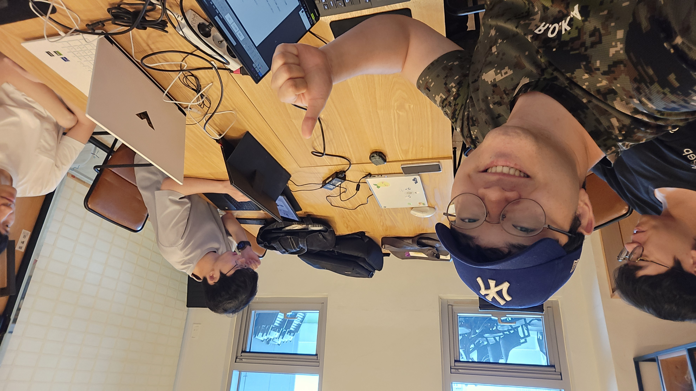
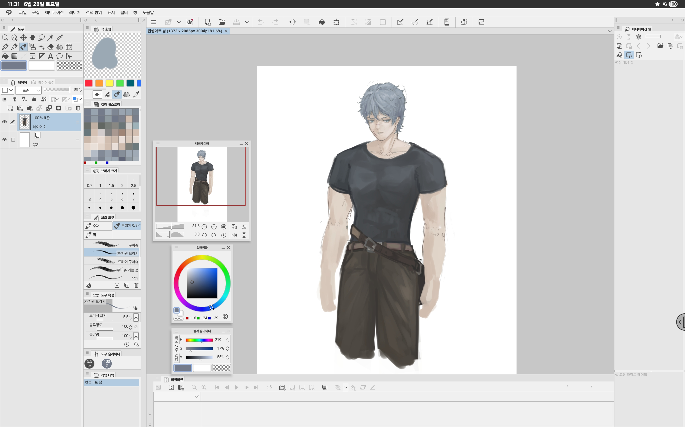

<!DOCTYPE html>
<html lang="ko">
<head>
  <meta charset="UTF-8" />
  <meta name="viewport" content="width=device-width, initial-scale=1.0"/>
  <title>Team Cossassin - Game Dev Team</title>
  <link href="https://fonts.googleapis.com/css2?family=Anton&display=swap" rel="stylesheet">
  <link rel="stylesheet" href="styles/style.css" />
</head>
<body>
  

    
    <header class="site-header">
      

        
        
        <nav class="nav-right">
         <a href="#about">About</a>
         <a href="#team">Contact</a>
        </nav>
      

    </header>

  Team Cossassin

  <section class="main-image-slider">
    

      
      
      
    

  </section>

    <section class="intro" id="about">
      
About Us

      

        TEAM COSSASSIN은 날카로운 기획력과 정밀한 코드로, 장르의 틈새를 파고드는 게임 개발팀입니다. 
        우리는 색다른 게임 아이디어를 현실로 만드는 데 집중하며, 
        재미와 감동, 쾌감을 게임을 통해 동시에 전달합니다.
      

    </section>

    <section class="team-cards" id="team">
  
Our Team

  

    

      <h3>이가을</h3>
      
대표 Team Leader

    

    

      <h3>장기성</h3>
      
메인 개발자 Lead Developer

    

    

      <h3>신창호</h3>
      
서브 개발자 Assistant Developer

    

    

      <h3>조화영</h3>
      
웹 제작, SNS 담당자 Web Developer, Social Media Manager

    

    

      <h3>김재준</h3>
      
게임 아트 담당자 Game Artist

    

    

      <h3>이재학</h3>
      
기획 Game Design

    

  

</section>

    <section class="social-icons">
      
Follow Us

      <a href="https://www.instagram.com/team_cossassin/?igsh=ZDI4c3lkZWxrODVp" target="_blank">
        
        Instagram
      </a>
      <a href="https://youtube.com/@teamcossassin" target="_blank">
        
        YouTube
      </a>
    </section>

    <footer>
      &copy; 2025 Team Cossassin. All rights reserved.
    </footer>
  

  

</body>
</html>
