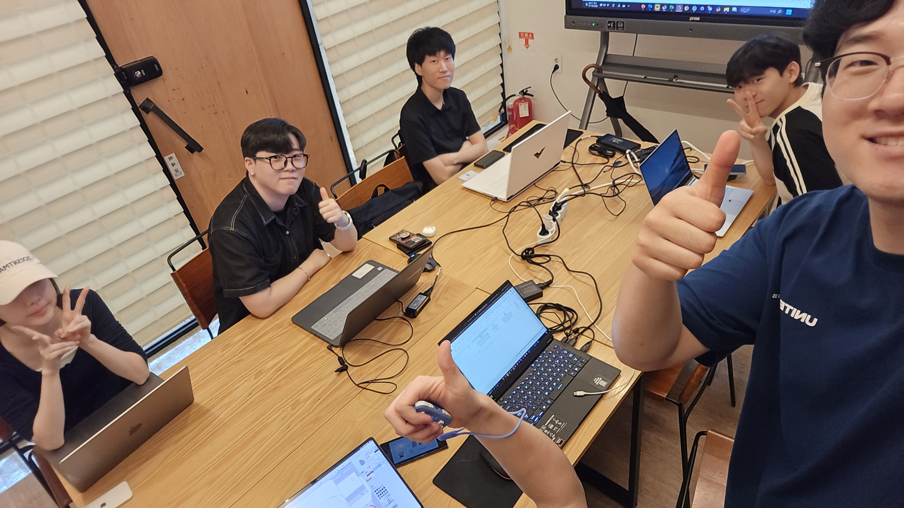
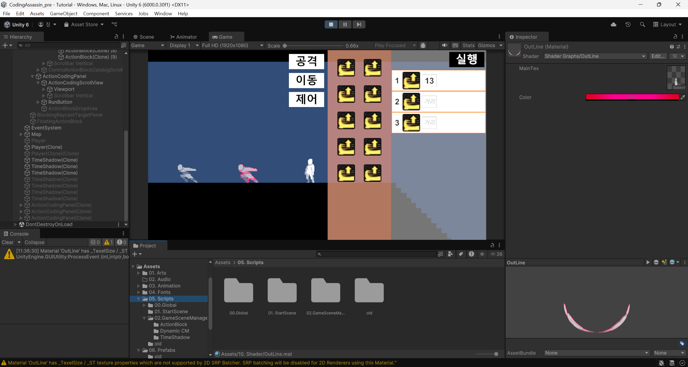

<!DOCTYPE html>
<html lang="ko">
<head>
    <meta charset="UTF-8" />
    <meta name="viewport" content="width=device-width, initial-scale=1.0"/>
    <title>Team Cossassin - Game Dev Team</title>
    <link href="https://fonts.googleapis.com/css2?family=Anton&display=swap" rel="stylesheet">
    <link rel="stylesheet" href="styles/style.css" />
</head>
<body>
    

        
        <header class="site-header">
            

                
                
                <nav class="nav-right">
                    <a href="#about">About</a>
                    <a href="#team">Contact</a>
                    <a href="#aboutgame">Our Games</a>
                    <a href="gallery.html">Gallery</a>
                </nav>
            

        </header>

        

            Team Cossassin
        

        <section class="main-image-slider">
            

                
                
                
            

        </section>

        <section class="intro" id="about">
            
About Us

            

                TEAM COSSASSIN은 날카로운 기획력과 정밀한 코드로, 장르의 틈새를 파고드는 게임 개발팀입니다. 
                우리는 색다른 게임 아이디어를 현실로 만드는 데 집중하며, 
                재미와 감동, 쾌감을 게임을 통해 동시에 전달합니다.  
                <a href="gallery.html" class="gallery-link">→ 팀 갤러리 보러가기</a>
            

        </section>

        <section class="game-section" id="aboutgame">
            
About Our Games

            
향수를 자극하는 감성 액션

            <h2 class="gradient-title">NOSTALGIA</h2>
            
            

                

                    

                        <video src="videos/short/11.mp4" autoplay muted loop playsinline></video>
                    

                    

                        <video src="videos/short/22.mp4" autoplay muted loop playsinline></video>
                    

                    

                        <video src="videos/short/33.mp4" autoplay muted loop playsinline></video>
                    

                

                

                    
                    
                    
                

            

            

                Team Cossassin이 만든 게임들을 만나보세요.  
                다양한 장르와 감각적인 연출이 어우러진 작품들을 소개합니다.  
                --  
            

        </section>

        <section class="team-cards" id="team">
            
Our Team

            

                

                    <h3>Gaeul Lee</h3>
                    
대표 Team Leader

                

                

                    <h3>테라 | Terrrrrrra</h3>
                    
메인 개발자 Lead Developer

                

                

                    <h3>Changho Shin</h3>
                    
서브 개발자 Assistant Developer

                

                

                    <h3>Hwayoung Cho</h3>
                    
웹 제작, SNS 담당자 Web Developer, Social Media Manager

                

                

                    <h3>Jaejun Kim</h3>
                    
게임 아트 담당자 Game Artist

                

                

                    <h3>Jaehak Lee</h3>
                    
기획 Game Design

                

            

        </section>

        <section class="social-icons">
            
Follow Us

            <a href="https://www.instagram.com/team_cossassin/?igsh=ZDI4c3lkZWxrODVp" target="_blank">
                
                Instagram
            </a>
            <a href="https://youtube.com/@teamcossassin" target="_blank">
                
                YouTube
            </a>
        </section>

        <footer>
            &copy; 2025 Team Cossassin. All rights reserved.
        </footer>
    

    

    
</body>
</html>
